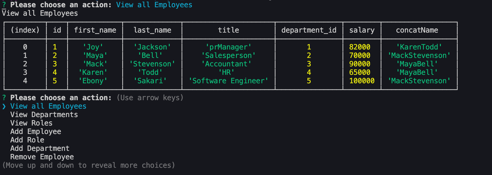

# Employee Tracker

## DESCRIPTION

This is application is an employee tracker that allows the user to view, add, remove, and update all company employees using node.js.

## SNAPSHOT

## MySql Syntax
[Click here for MySql Syntax](./schema.sql)
## Repo GitHub Link
[Click here for the Repository Link](https://github.com/Joydotcom/Employee_tracker)

## DEMO
[Click here to watch the demo!](https://drive.google.com/file/d/1w_RY5HCm0QmyM8s6R2oGmsKsfzSqVgSX/view)

